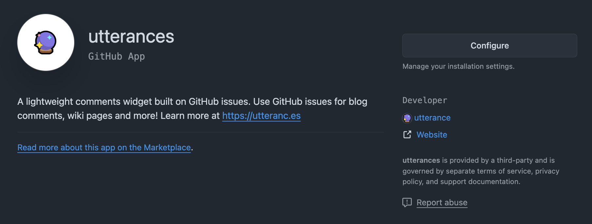
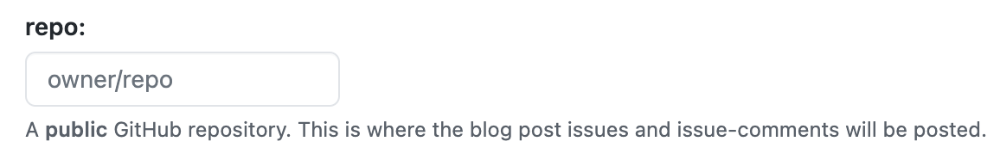
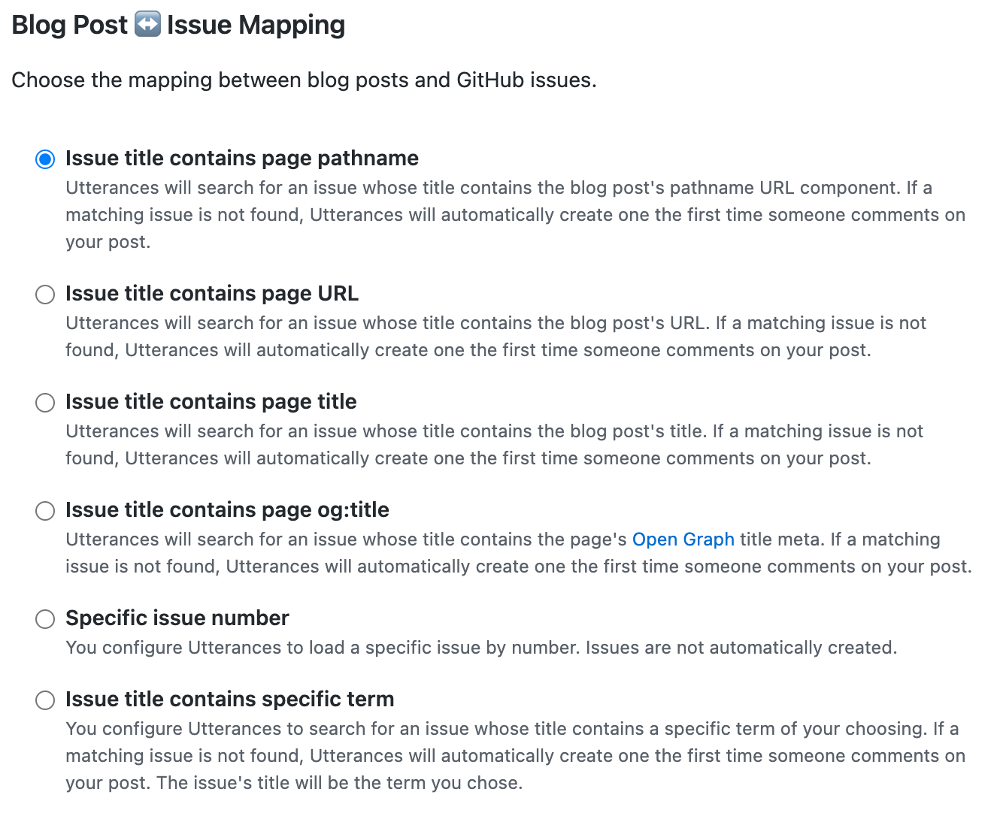

# 개요

> 이 포스트는 현재 보고 계신 블로그에 깃허브 이슈를 연동해 댓글 기능을 구현하는 내용을 담고 있습니다. 또한 많은 부분이 vitaneri 블로거의 내용을 참조하고 있습니다.

보통 블로그를 직접 구축할때 댓글 기능은 Github Issues를 연동해 구현된 라이브러리를 많이 사용합니다. 저 또한 비슷한 라이브러리를 찾아보았고 `disqus` 와 `Utterances`가 우선 순위에 들어왔습니다.

결과적으론 연동 방법과 작동 방식이 간편하다고 하는 [Utterances](https://utteranc.es/)를 선택했습니다.

# Utterances ?

공식 문서를 참조하여 간단히 특징을 나열해 보자면

- 오픈 소스 입니다.
- 불필요한 코드와 광고가 없는 완전 무료입니다.
- 모든 자료가 깃허브 이슈에 저장됩니다.
- 깃허브를 구동하는 CSS 툴킷인 Primer로 스타일링을 했습니다.
- 다크 테마도 적용됩니다.
- 바닐라 타입스크립트로 개발되어 가볍습니다. 다른 프레임워크 사용 또는 폴리필이 없습니다.

# 작동 방식

Utterances가 로드되면 [Github issue search API](https://docs.github.com/ko/rest/search?apiVersion=2022-11-28#search-issues)를 통해 포스팅의 url과 pathname 혹은 title 정보를 가지고 관련 깃허브 페이지를 찾습니다. 이때 해당 게시물에 이슈가 없다면 [utterances-bot](https://github.com/utterances-bot?tab=overview&from=2023-12-01&to=2023-12-31)가 대신 이슈를 만들어주고 요청한 댓글이 달립니다.

<aside class='warning'>
⚠️ 해당 봇의 깃허브 페이지를 가면 봇이 자동으로 만들어준 모든 이슈 생성 이력이 잔디밭에 남아 있고 누구의 레포에 남겨진 이슈인지도 볼 수 있습니다.

해킹의 우려까진 모르겠으나 뭔가 프라이빗한 맛은 없다는 점을 인지하고 사용해야 합니다!

</aside>

# 적용 방법

1. 해당 기능을 적용할 저장소는 `public`으로 해야합니다.

   - `private`으로 적용하면 댓글을 남이 볼 수 없습니다.

2. [utterances 설치 페이지](https://github.com/apps/utterances)로 가서 설치 합니다.
   

   - 기본적으로 설치 되어 있지 않다면 `Configure` 버튼 대신 `Install` 버튼이 보일 겁니다. 선택하시면 저장소를 선택하시는 페이지가 나오고 댓글 기능을 적용할 저장소를 선택합니다. 이 과정에서 추가 인증이 필요할 수도 있습니다.

3. Repository - 이후 공식문서로 이동해 페이지 내의 repo란에 `계정이름/저장소이름` 순으로 입력합니다. 이후의 과정은 Utterances 초기화 코드 생성을 위한 기본적인 양식 작성이라 생각하시면 됩니다.
   

4. Blog Post ↔️ Issue Mapping - 이슈와 포스트를 맵핑해주는 방식을 선택합니다.
   

   - 여러가지 방법이 있지만 일반적으로 선호되는 pathname이나 url을 선택합니다.

5. Issue Label - 이슈에 기본으로 달릴 라벨을 선택합니다. 공식 문서에도 나와있지만 해당 레포에 존재하는 라벨을 사용해야 합니다. 존재하지 않는 라벨을 작성해 놓으면 봇이 추가적으로 라벨을 생성해주지 않습니다. 기본으로 내장되 있는 comments 를 사용하는게 무난해 보입니다.

6. Theme - 댓글의 테마를 선택합니다. 다크 모드를 토글하는 사이트라면 추후 동적으로 변경할 수 있습니다.

7. Copy & Paste - 이후 나오는 코드 블록을 복사 한뒤 자신이 사용중인 프레임워크 양식에 맞게 사용할 곳에다 붙여 넣으면 됩니다.

```js
// 대략적인 양식
<script
  src="https://utteranc.es/client.js"
  repo="[ENTER REPO HERE]"
  issue-term="[ISSUE TERM]"
  label="[LABEL NAME]"
  theme="[THEME NAME]"
  crossorigin="anonymous"
  async
></script>
```

# Astro에 적용하기

Astro는 아일랜드를 구축하지 않으면 기본적으로 바닐라 자바스크립트를 이용합니다. 하지만 React와 같은 컴포넌트 패러다임의 특징을 가져올 수 있습니다.

`Utterances.astro` 와 같은 컴포넌트 파일을 하나 만듭니다.

```astro
// Utterances.astro
<div id="utterances-container"></div>

<script>
  const script = document.createElement("script");
  const container = document.querySelector("#utterances-container");
  const currentTheme = localStorage.theme;
  Object.entries({
    src: "https://utteranc.es/client.js",
    repo: "kidboi666/ssg-blog",
    "issue-term": "pathname",
    label: "comments",
    theme: currentTheme === "light" ? "github-light" : "github-dark",
    crossorigin: "anonymous",
  }).forEach(([key, value]) => {
    script.setAttribute(key, value);
  });

  container?.appendChild(script);
</script>
```

추가적으로 기본 양식에 테마 부분을 동적으로 가져오는 구문도 넣어줍니다.

좋습니다.

그런 다음 해당 컴포넌트를 댓글 기능을 사용할 페이지에서 불러오면 됩니다. 저의 경우 `PostLayout.astro` 파일에 불러와 사용했습니다.

```astro ins={25}
---
import TableOfContents from "@components/TableOfContents";
import Layout from "./Layout.astro";
import { getEntry } from "astro:content";
import Utterances from "@components/Utterances.astro";

const { frontmatter } = Astro.props;
const { slug } = Astro.params;

const post: any = await getEntry(frontmatter.category, slug);
const { headings } = await post.render(post);
---

<Layout headings={headings}>
  <div>
    <p class="m-0 text-5xl font-bold text-zinc-700 dark:text-zinc-200">
      {frontmatter.title}
    </p>
    <p class="ml-px mt-2 text-sm text-zinc-500">
      등록일 : {new Date(frontmatter.pubDate).toLocaleDateString()}
    </p>

    <slot />

    <Utterances />
    <TableOfContents client:only="preact" headings={headings} />
  </div>
</Layout>
```

이제 댓글 기능은 정상적으로 작동합니다. 하지만 아직 완벽하진 않습니다. 다크 모드를 토글할 시 Utterances의 테마도 함께 변경되고자 합니다. 현재 작성한 코드는 처음 마운트 될때만 현재의 테마를 적용할 뿐입니다.

# 동적으로 테마 적용

```js
function toggleUtterancesTheme() {
  if (document.querySelector(".utterances-frame")) {
    const theme = localStorage.getItem("theme") === "light" ? "github-light" : "github-dark";
    const message = {
      type: "set-theme",
      theme,
    };
    const iframe = document.querySelector(".utterances-frame") as HTMLIFrameElement; // omit as HTMLIFrameElement if you're wring JS
    iframe?.contentWindow?.postMessage(message, "https://utteranc.es");
  }
}
```

위 코드는 현재 테마 정보를 Utterances IFrame 에 보내고 필요한 테마 값을 응답 받을 수 있는 구문 입니다. 위 함수를 테마를 토글할 때 마다 실행시킨다면 우리가 원하는 결과를 얻을 수 있을겁니다.

```jsx ins={14}
// ThemeButton.tsx
const handleThemeChange = () => {
  if (localStorage.theme === "dark") {
    localStorage.theme = "light";
    setDark(false);
    document.documentElement.classList.remove("dark");
    document.documentElement.classList.add("light");
  } else {
    localStorage.theme = "dark";
    setDark(true);
    document.documentElement.classList.remove("light");
    document.documentElement.classList.add("dark");
  }
  toggleUtterancesTheme();
};
```

그러면 이제 `localStorage`의 테마 값에 따라 Utterances 테마도 변경됩니다.
