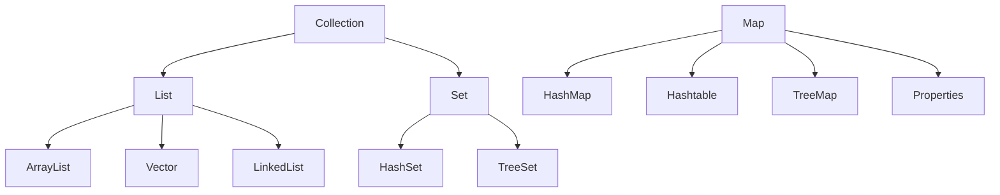
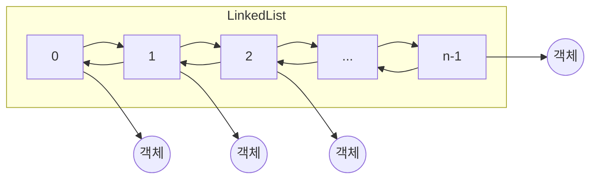
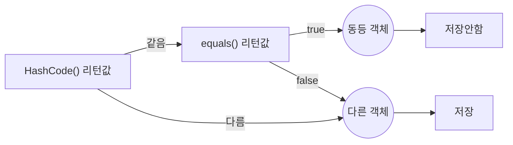

# 컬렉션 프레임워크

자바는 널리 알려져 있는 자료구조를 바탕으로 객체들을 효율적으로 추가, 삭제 검색할 수 있도록 관련된 인터페이스와 클래스들을 `java.util` 패키지에 포함시켜 놓았다. 이들을 총칭해서 컬렉션 프레임워크라고
부른다. 컬렉션 프레임워크는 몇 가지 인터페이스를 통해서 다양한 컬렉션 클래스를 이용할 수 있도록 설계되어 있다. 주요 인터페이스로는 `List`,`Set`,`Map`이 있는데, 이 인터페이스로 사용 가능한 컬렉션
객체의 종류는 다음과 같다.



`List`와 `Set`은 객체를 추가, 삭제 검색하는 방법에 있어서 공통점이 있기 때문에 공통된 메소드만 따로 모아 `Collection` 인터페이스로 정의해 두고 이것을 상속하고 있다. `Map`은 키와 값을
하나의 쌍으로 묶어서 관리하는 구조로 되어 있어 `List`와 `Set`과는 사용 방법이 다르다. 다음은 각 인터페이스 별로 사용할 수 있는 컬렉션의 특징을 정리한 것이다.

<table>
<tr>
  <th colspan="2">인터페이스 분류</th>
  <th>특징</th>
  <th>구현 클래스</th>
</tr>
<tr>
  <td rowspan="2">Collection</td>
  <td>List</td>
  <td>- 순서를 유지하고 저장 <br/> - 중복 저장 가능</td>
  <td>ArrayList, Vector, LinkedList</td>
</tr>
<tr>
  <td>Set</td>
  <td>- 순서를 유지하지 않고 저장 <br/>- 중복 저장 안됨</td>
  <td>HashSet, TreeSet</td>
</tr>
<tr>
  <td colspan="2">Map</td>
  <td>- 키와 값으로 구성된 엔트리 저장 <br/>- 키는 중복 저장 안됨</td>
  <td>HashMap, Hashtable, TreeMap, Properties</td>
</tr>
</table>

# List 컬렉션

`List` 컬렉션은 객체를 인덱스로 관리하기 때문에 객체를 저장하면 인덱스가 부여되고 인덱스로 객체를 검색, 삭제할 수 있는 기능을 제공한다.

`List` 컬렉션에는 `ArrayList`, `Vector`, `LinkedList` 등이 있는데, `List` 컬렉션에서 공통적으로 사용 가능한 `List` 인터페이스 메소드는 다음과 같다. 인덱스로 객체들이
관리되기 때문에 인덱스를 매개값으로 갖는 메소드들이 많다.

<table>
<tr>
    <th>기능</th>
    <th>메소드</th>
    <th>설명</th>
</tr>
<tr>
    <td rowspan="3">객체 추가</td>
    <td>boolean add(E e)</td>
    <td>주어진 객체를 맨 끝에 추가</td>
</tr>
<tr>
    <td>void add(int index, E element)</td>
    <td>주어진 인덱스에 객체를 추가</td>
</tr>
<tr>
    <td>set(int index, E element)</td>
    <td>주어진 인덱스의 객체를 새로운 객체로 바꿈</td>
</tr>
<tr>
    <td rowspan="4">객체 검색</td>
    <td>boolean contains(Object o)</td>
    <td>주어진 객체가 저장되어 있는지 여부</td>
</tr>
<tr>
    <td>E get(int index)</td>
    <td>주어진 인덱스에 저장된 객체를 리턴</td>
</tr>
<tr>
    <td>isEmpty()</td>
    <td>컬렉션이 비어 있는지 조사</td>
</tr>
<tr>
    <td>int size()</td>
    <td>저장되어 있는 전체 객체 수를 리턴</td>
</tr>
<tr>
    <td rowspan="3">객체 삭제</td>
    <td>void clear()</td>
    <td>저장된 모든 객체를 삭제</td>
</tr>
<tr>
    <td>E remove(int index)</td>
    <td>주어진 인덱스에 저장된 객체를 삭제</td>
</tr>
<tr>
    <td>boolean remove(Object o)</td>
    <td>주어진 객체를 삭제</td>
</tr>
</table>

## ArrayList

`ArrayList`는 `List` 컬렉션에서 가장 많이 사용하는 컬렉션이다. `ArrayList`에 객체를 추가하면 내부 배열에 객체가 저장된다. 일반 배열과의 차이점은 `ArrayList`는 제한 없이 객체를
추가할 수 있다는 것이다.

`List` 컬렉션은 객체 자체를 저장하는 것이 아니라 객체의 번지를 저장한다. 또한 동일한 객체를 중복 저장할 수 있는데, 이 경우에는 동일한 번지가 저장된다. null 또한 저장이 가능하다.
`ArrayList` 컬렉션은 다음과 같이 생성할 수 있다.

```java
List<E> list = new ArrayList<E>(); // E에 지정된 타입의 객체만 저장
List<E> list = new ArrayList<>(); // E에 지정된 타입의 객체만 저장
List list = new ArrayList(); // 모든 타입의 객체를 저장
```

타입 파라미터 `E` 에는 `ArrayList`에 저장하고 싶은 객체 타입을 지정하면 된다. `List`에 지정한 객체 타입과 동일하다면 `ArrayList<>`와 같이 객체 타입을 생략할 수도 있다. 객체 타입을
모두 생략하면 모든 종류의 객체를 저장할 수 있다.

`ArrayList` 컬렉션에 객체를 추가하면 인덱스 0번부터 차례대로 저장된다. 특정 인덱스의 객체를 제거하면 바로 뒤 인덱스부터 마지막 인덱스까지 모두 앞으로 1씩 당겨진다. 마찬가지로 특정 인덱스에 객체를
삽입하면 해당 인덱스부터 마지막 인덱스까지 모두 1씩 밀려난다.

따라서 빈번한 객체 삭제와 삽입이 일어나는 곳에서는 `ArrayList`를 사용하는 것은 바람직하지 않다. 대신 이런 경우라면 `LinkedList`를 사용하는 것이 좋다. 다음은 `ArrayList`에 객체를
추가, 검색, 삭제하는 방법을 보여 준다.

```java
// Board.java

public class Board {
  private String subject;
  private String content;
  private String writer;

  public Board(String subject, String content, String writer) {
    this.subject = subject;
    this.content = content;
    this.writer = writer;
  }

  public String getSubject() {
    return subject;
  }

  public void setSubject(String subject) {
    this.subject = subject;
  }

  public String getContent() {
    return content;
  }

  public void setContent(String content) {
    this.content = content;
  }

  public String getWriter() {
    return writer;
  }

  public void setWriter(String writer) {
    this.writer = writer;
  }
}

```

```java
// ArrayListExample.java

import java.util.ArrayList;
import java.util.List;

public class ArrayListExample {
  public static void main(String[] args) {
    // ArrayList 컬렉션 생성
    List<Board> list = new ArrayList<>();

    // 객체 추가
    list.add(new Board("제목1", "내용1", "글쓴이1"));
    list.add(new Board("제목2", "내용2", "글쓴이2"));
    list.add(new Board("제목3", "내용3", "글쓴이3"));
    list.add(new Board("제목4", "내용4", "글쓴이4"));
    list.add(new Board("제목5", "내용5", "글쓴이5"));

    // 저장된 총 객체 수 얻기
    int size = list.size();
    System.out.println("총 객체 수: " + size);
    System.out.println(); // 빈 줄 삽입

    // 특정 인덱스의 객체 가져오기
    Board board = list.get(2);
    System.out.println(board.getSubject() + "\t" + board.getContent() + "\t" + board.getWriter());
    System.out.println();

    // 모든 객체를 하나씩 가져오기
    for (int i = 0; i < list.size(); i++) {
      Board b = list.get(i);
      System.out.println(b.getSubject() + "\t" + b.getContent() + "\t" + b.getWriter());
      System.out.println();
    }

    // 객체 삭제
    list.remove(2);
    list.remove(2);

    // 향상된 for 문으로 모든 객체를 하나씩 가져오기
    for (Board b : list) {
      System.out.println(b.getSubject() + "\t" + b.getContent() + "\t" + b.getWriter());
    }
  }
}
```

**실행 결과**

```zsh showLineNumbers=false
총 객체 수: 5

제목3   내용3   글쓴이3

제목1   내용1   글쓴이1
제목2   내용2   글쓴이2
제목3   내용3   글쓴이3
제목4   내용4   글쓴이4
제목5   내용5   글쓴이5

제목1   내용1   글쓴이1
제목2   내용2   글쓴이2
제목5   내용5   글쓴이5
```

## Vector

`Vector`는 `ArrayList`와 동일한 내부 구조를 가지고 있다. 차이점은 `Vector`는 동기화된 메소드로 구성되어 있기 때문에 멀티 스레드가 동시에 `Vector()` 메소드를 실행할 수 없다는
것이다. 그렇기 때문에 멀티 스레드 환경에서는 안전하게 객체를 추가 또는 삭제할 수 있다.

`Vector` 컬렉션은 다음과 같이 생성할 수 있다.

```java
List<E> list = new Vector<E>(); // E에 지정된 타입의 객체만 저장 
List<E> list = new Vector<>(); // E에 지정된 타입의 객체만 저장
List list = new Vector(); // 모든 타입의 객체를 저장
```

타입 파라미터 `E`에는 `Vector`에 저장하고 싶은 객체 타입을 지정하면 된다. `List`에 지정한 객체 타입과 동일하다면 `Vector<>`와 같이 객체 타입을 생략할 수도 있다. 객체 타입을 모두 생략하면
모든 종류의 객체를 저장할 수 있다.

다음은 `ThreadA`와 `ThreadB`에서 동시에 `Board` 객체를 `Vector`에 각각 1000개씩 추가한 후, 전체 저장된 수를 출력하는 예제이다.

```java
// VectorExample.java

import java.util.List;
import java.util.Vector;

public class VectorExample {
  public static void main(String[] args) {
    // Vector 컬렉션 생성
    List<Board> list = new Vector<>();
  }

  // 작업 스레드 객체 생성
  Thread threadA = new Thread() {
    @Override
    public void run() {
      // 객체 1000개 추가
      for (int i = 1; i <= 1000; i++) {
        list.add(new Board("제목" + i, "내용" + i, "글쓴이" + i));
      }
    }
  };

  // 작업 스레드 객체 생성
  Thread threadB = new Thread() {
    @Override
    public void run() {
      // 객체 1000개 추가
      for (int i = 1; i <= 1000; i++) {
        list.add(new Board("제목" + i, "내용" + i, "글쓴이" + i));
      }
    }
  };

  // 작업 스레드 실행
  threadA.start();
  threadB.start();

  // 작업 스레드들이 모두 종료될 때까지 메인 스레드를 기다리게 함
  try

  {
    threadA.join();
    threadB.join();
  } catch(
  Exception e)

  {

  }

  // 저장된 총 객체 수 얻기
  int size = list.size();
  System.out.println("총 객체 수: "+size);
  System.out.println();
}
```

__실행 결과__

```zsh showLineNumbers=false
총 객체 수: 2000
```

실행 결과를 보면 정확하게 2000개가 저장되었음을 알 수 있다. 9라인을 변경하고 실행해 보자.

```zsh showLineNumbers=false
List<Board> list = new ArrayList<>();
```

실행 결과는 2000개가 나오지 않거나, PC에 따라 에러가 발생할 수 있다. 그 이유는 `ArrayList`는 두 스레드가 동시에 `add()` 메소드를 호출할 수 있기 때문에 경합이 발생해 결국은 하나만 저장되기
때문이다. 반면에 `Vector`의 `add()`는 동기화 메소드이므로 한 번에 하나의 스레드만 실행할 수 있어 경합이 발생하지 않는다.

## LinkedList

`LinkedList`는 `ArrayList`와 사용 방법은 동일하지만 내부 구조는 완전히 다르다. `ArrayList`는 내부 배열에 객체를 저장하지만, `LinkedList`는 인접 객체를 체인처럼 연결해서
관리한다.



`LinkedList`는 특정 위치에서 객체를 삽입하거나 삭제하면 바로 앞뒤 링크만 변경하면 되므로 빈번한 객체 삭제와 삽입이 일어나는 곳에서는 `ArrayList`보다 좋은 성능을 발휘한다.

`LinkedList` 컬렉션은 다음과 같이 생성할 수 있다.

```java
List<E> list = new LinkedList<E>(); // E에 지정된 타입의 객체만 저장
List<E> list = new LinkedList<>(); // E에 지정된 타입의 객체만 저장
List list = new LinkedList(); // 모든 타입의 객체를 저장
```

다음 예제는 `ArrayList`에 10000개의 객체를 삽입하는데 걸린 시간을 측정한 것이다. 0번 인덱스에 `String` 객체를 10000번 추가하기 위해 `List` 인터페이스의
`add(int index, E element)` 메소드를 이용하였다.

```java
// LinkedListExample.java

import java.util.ArrayList;
import java.util.LinkedList;
import java.util.List;

public class LinkedListExample {
  public static void main(String[] args) {
    // ArrayList 컬렉션 객체 생성
    List<String> list1 = new ArrayList<String>();

    // LinkedList 컬렉션 객체 생성
    List<String> list2 = new LinkedList<String>();

    // 시작 시간과 끝 시간을 저장할 변수 선언
    long startTime;
    long endTime;

    // ArrayList 컬렉션에 저장하는 시간 측정
    startTime = System.nanoTime();
    for (int i = 0; i < 10000; i++) {
      list1.add(0, String.valueOf(i));
    }
    endTime = System.nanoTime();
    System.out.println("%-17s %8d ns \n", "ArrayList 걸린 시간: ", (endTime - startTime));

    // LinkedList 컬렉션에 저장하는 시간 측정
    startTime = System.nanoTime();
    for (int i = 0; i < 10000; i++) {
      list2.add(0, String.valueOf(i));
    }
    endTime = System.nanoTime();
    System.out.println("%-17s %8d ns \n", "LinkedList 걸린 시간: ", (endTime - startTime));
  }
}
```

__실행 결과__

```zsh showLineNumbers=false
ArrayList 걸린 시간: 4265400 ns
LinkedList 걸린 시간: 1045500 ns
```

실행 결과를 보면 `LinkedList` 훨씬 빠른 성능을 낸다. `ArrayList`가 느린 이유는 0번 인덱스에 새로운 객체가 추가되면서 기존 객체의 인덱스를 한 칸씩 뒤로 미는 작업을 하기 때문이다.

# Set 컬렉션

`List` 컬렉션은 저장 순서를 유지하지만, `Set` 컬렉션은 저장 순서가 유지되지 않는다. 또한 객체를 중복해서 저장할 수 없고, 하나의 null만 저장할 수 있다. `Set` 컬렉션은 수학의 집합에 비유될 수
있다. 집합은 순서와 상관없고 중복이 허용되지 않기 때문이다.

`Set` 컬렉션은 또한 구슬 주머니와도 같다. 동일한 구슬을 두 개 넣을 수 없으며, 들어갈 (저장할) 때와 나올 (찾을) 때의 순서가 다를 수도 있기 때문이다.

`Set` 컬렉션에는 `HashSet`, `LinkedHashSet`, `TreeSet` 등이 있는데, `Set` 컬렉션에서 공통적으로 사용 가능한 `Set` 인터페이스의 메소드는 다음과 같다. 인덱스로 관리하지
않기 때문에 인덱스를 매개 값으로 갖는 메소드가 없다.

<table>
<tr>
  <th>기능</th>
  <th>메소드</th>
  <th>설명</th>
</tr>
<tr>
  <td>객체 추가</td>
  <td>boolean add(E e)</td>
  <td>주어진 객체를 성공적으로 저장하면 true를 리턴하고 중복 객체면 false를 리턴</td>
</tr>
<tr>
  <td rowspan="4">객체 검색</td>
  <td>boolean contains(Object o)</td>
  <td>주어진 객체가 저장되어 있는지 여부</td>
</tr>
<tr>
  <td>isEmpty()</td>
  <td>컬렉션이 비어 있는지 조사</td>
</tr>
<tr>
  <td>Iterator<E> iterator()</td>
  <td>저장된 객체를 한 번씩 가져오는 반복자 리턴</td>
</tr>
<tr>
  <td>int size()</td>
  <td>저장되어 있는 전체 객체 수 리턴</td>
</tr>
<tr>
  <td rowspan="2">객체 삭제</td>
  <td>void clear()</td>
  <td>저장된 모든 객체를 삭제</td>
</tr>
<tr>
  <td>boolean remove(Object o)</td>
  <td>주어진 객체를 삭제</td>
</tr>
</table>

## HashSet

`Set` 컬렉션 중에서 가장 많이 사용되는 것이 `HashSet`이다. 다음은 `HashSet` 컬렉션을 생성하는 방법이다.

```java
Set<E> set = new HashSet<E>();
Set<E> set = new HashSet<>();
Set set = new HashSet();
```

타입 파라미터 `E`에는 `HashSet`에 저장하고 싶은 객체 타입을 지정하면 된다. `Set`에 지정한 객체 타입과 동일하다면 `HashSet<>`과 같이 객체 타입을 생략할 수도 있다. 객체 타입을 모두
생략하면 모든 종류의 객체를 저장할 수 있다.

`HashSet`은 동일한 객체는 중복 저장하지 않는다. 여기서 동일한 객체란 동등 객체를 말한다. `HashSet`은 다른 객체라도 `hashCode()` 메소드의 리턴값이 같고, `equals()` 메소드가
`true`를 리턴하면 동일한 객체라고 판단하고 중복 저장하지 않는다.



문자열을 `HashSet`에 저장할 경우, 같은 문자열을 갖는 `String` 객체는 동등한 객체로 간주한다. 같은 문자열이면 `hashCode()`의 리턴값이 같고 `equals()`의 리턴값이 `true`가
나오기 때문이다.

```java
// HashSetExample.java

import java.util.*;

public class HashSetExample {
  public static void main(String[] args) {
    // HashSet 컬렉션 생성
    Set<String> set = new HashSet<String>();

    // 객체 저장
    set.add("Java");
    set.add("JDBC");
    set.add("JSP");
    set.add("Java"); // <- 중복 객체이므로 저장하지 않음
    set.add("Spring");

    // 저장된 객체 수 출력
    int size = set.size();
    System.out.println("총 객체 수: " + size);
  }
}
```

__실행 결과__

```zsh
총 객체 수: 4
```

이 다음 예제는 이름과 나이가 동일할 경우 `Member` 객체를 `HashSet`에 중복 저장하지 않는다. `Member` 클래스를 선언할 때 이름과 나이가 동일하다면 동일한 해시코드가 리턴되도록
`hashCode()`를 재정의하고, `equals()` 메소드가 `true`를 리턴하도록 재정의했기 때문이다.

```java
// Member.java

public class Member {
  public String name;
  public int age;

  public Member(String name, int age) {
    this.name = name;
    this.age = age;
  }

  // HashCode 재정의
  @Override
  public int hashCode() {
    return name.hashCode() + age;
  }

  // eqauls 재정의
  @Override
  public boolean equals(Object obj) {
    if (obj instanceof Member target) {
      return target.name.equals(name) && (target.age == age);
    } else {
      return false;
    }
  }
}
```

```java
// HashSetExample.java

import java.util.*;

public class HashSetExample {
  public static void main(String[] args) {
    // HashSet 컬렉션 생성
    Set<Member> set = new HashSet<Member>();

    // Member 객체 저장
    set.add(new Member("홍길동", 30));
    set.add(new Member("홍길동", 30));

    // 저장된 객체 수 출력
    System.out.println("총 객체 수: " + set.size());
  }
}
```

__실행 결과__

```zsh showLineNumbers=false
총 객체 수: 1
```

`Set` 컬렉션은 인덱스로 객체를 검색해서 가져오는 메소드가 없다. 대신 객체를 한 개씩 반복해서 가져와야 하는데, 여기에는 두 가지 방법이 있다. 하나는 다음과 같이 `for` 문을 이용하는 것이다.

```java
Set<E> set = new HashSet<>();
for(
E e :set){
    // ...
    }
```

다른 방법은 다음과 같이 `Set` 컬렉션의 `iterator()` 메소드로 반복자를 얻어 객체를 하나씩 가져오는 것이다. 타입 파라미터 `E`는 `Set` 컬렉션에 저장되어 있는 객체의 타입이다.

```java
Set<E> set = new HashSet<>();
Iterator<E> iterator = set.iterator();
```

`iterator`는 `Set` 컬렉션의 객체를 가져오거나 제거하기 위해 다음 메소드를 제공한다.

| 리턴 타입   | 메소드명      | 설명                                      |
|---------|-----------|-----------------------------------------|
| boolean | hasNext() | 가져올 객체가 있으면 true를 리턴하고 없으면 false를 리턴한다. |
| E       | next()    | 컬렉션에서 하나의 객체를 가져온다.                     |
| void    | remove()  | next()로 가져온 객체를 Set 컬렉션에서 제거한다.         |

사용 방법은 다음과 같다.

```java

while(iterator.hasNext()){
E e = iterator.next();
}
```

`hasNext()` 메소드로 가져올 객체가 있는지 먼저 확인하고, `true`를 리턴할 때만 `next()` 메소드로 객체를 가져온다. 만약 `next()`로 가져온 객체를 컬렉션에서 제거하고 싶다면
`remove()` 메소드를 사용한다.

```java
// HashSetExample.java

import java.util.*;

public class HashSetExample {
  public static void main(String[] args) {
    // HashSet 컬렉션 생성
    Set<String> set = new HashSet<String>();

    // 객체 추가
    set.add("Java");
    set.add("JDBC");
    set.add("JSP");
    set.add("Spring");

    // 객체를 하나씩 가져와서 처리
    Iterator<String> iterator = set.iterator();
    while (iterator.hasNext()) {
      // 객체를 하나 가져오기
      String element = iterator.next();
      System.out.println(element);
      if (element.equals("JSP")) {
        // 가져온 객체를 컬렉션에서 제거
        iterator.remove();
      }
    }

    System.out.println();

    // 객체 제거
    set.remove("JDBC");

    // 객체를 하나씩 가져와서 처리
    for (String element : set) {
      System.out.println(element);
    }
  }
}
```

__실행 결과__

```zsh showLineNumbers=false
Java
JSP
JDBC
Spring

Java
Spring
```

# Map 컬렉션

`Map` 컬렉션은 키와 값으로 구성된 엔트리 객체를 저장한다. 여기서 키와 값은 모두 객체이다. 키는 중복 저장할 수 없지만 값은 중복 저장할 수 있다. 기존에 저장된 키와 동일한 키로 값을 저장하면 기존의 값은 없어지고 새로운 값으로 대치된다.

`Map` 컬렉션에는 `HashMap`, `Hashtable`, `LinkedHashMap`, `Properties`, `TreeMap` 등이 있다. `Map` 컬렉션에서 공통적으로 사용 가능한 `Map` 인터페이스 메소드는 다음과 같다. 키로 객체들을 관리하기 때문에 키를 매개값으로 갖는 메소드가 많다.

<table>
<tr>
  <th>기능</th>
  <th>메소드</th>
  <th>설명</th>
</tr>
<tr>
  <td>객체 추가</td>
  <td>V put(K key, V value)</td>
  <td>주어진 키와 값을 추가, 저장이 되면 값을 리턴</td>
</tr>
<tr>
  <td rowspan="8">객체 검색</td>
  <td>boolean containsKey(Object key)</td>
  <td>주어진 키가 있는지 여부</td>
</tr>
<tr>
  <td>boolean containsValue(Object value)</td>
  <td>주어진 값이 있는지 여부</td>
</tr>
<tr>
  <td>Set&lt;Map.Entry&lt;K,V&gt;&gt; entrySet()</td>
  <td>키와 값의 쌍으로 구성된 모든 Map.Entry 객체를 Set에 담아서 리턴</td>
</tr>
<tr>
  <td>V get(Object key)</td>
  <td>주어진 키의 값을 리턴</td>
</tr>
<tr>
  <td>boolean isEmpty()</td>
  <td>컬렉션이 비어있는지 여부</td>
</tr>
<tr>
  <td>Set&lt;K&gt; keySet()</td>
  <td>모든 키를 Set 객체에 담아서 리턴</td>
</tr>
<tr>
  <td>int size()</td>
  <td>저장된 키의 총 수를 리턴</td>
</tr>
<tr>
  <td>Collection&lt;V&gt; values()</td>
  <td>저장된 모든 값 Collection에 담아서 리턴</td>
</tr>
<tr>
  <td rowspan="2">객체 삭제</td>
  <td>void clear()</td>
  <td>모든 Map.Entry(키와 값)를 삭제</td>
</tr>
<tr>
  <td>V remove(Object key)</td>
  <td>주어진 키와 일치하는 Map.Entry 삭제, 삭제가 되면 값을 리턴</td>
</tr>
</table>

앞의 표에서 메소드의 매개변수 타입과 리턴 타입에 `K`와 `V`라는 타입 파라미터가 있는데, `K`는 키 타입, `V`는 값 타입을 말한다.

