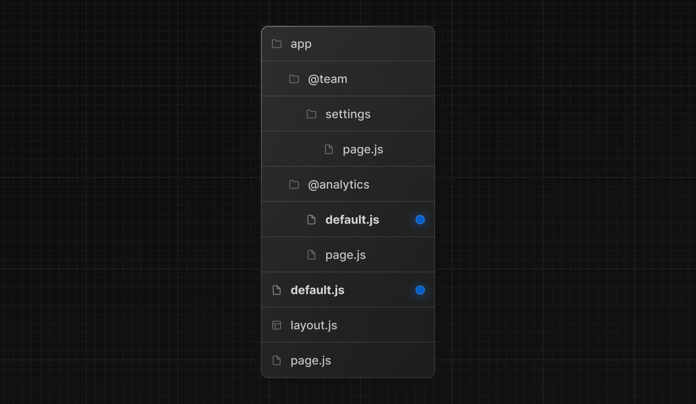
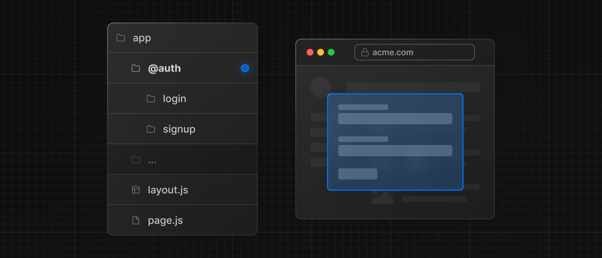
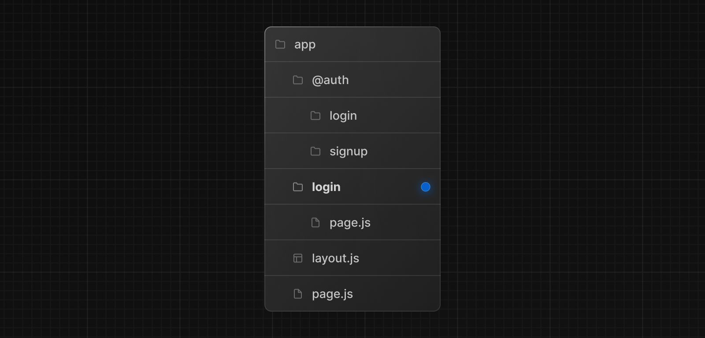
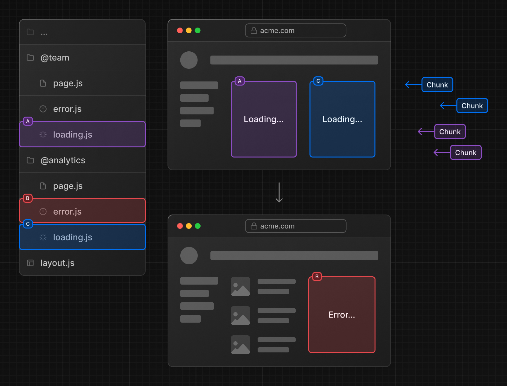

# Parallel Routes

평행 라우팅을 사용하면 같은 레이아웃에 여러 페이지를 동시에 또는, 조건부로 렌더링 할 수 있습니다. 이는 대시보드나 소셜 사이트의 피드와 같은 동적인 부분을 렌더링 하는데에 유리합니다.

대시 보드를 예로 들면, `team` 섹션과 `analytics` 섹션을 한 화면에 동시에 렌더링 할 수 있습니다.

.avif>)

병렬 경로는 명명된 슬롯을 사용하여 생성됩니다.

# Slots

평행 라우트는 이름 붙여진 **slots** 을 통해 만들어 집니다. Slots은 `@folder`와 같은 방식으로 정해집니다. 예를 들면, `@analytics`와 `@team` 두 파일은 그 이름 그대로의 **slots** 을 정의합니다.

.avif>)

slots은 부모 `layout.jsx` 파일의 props로 전달됩니다. 이제 `app/layout.tsx` 파일에서 `children` 요소와 함께 병렬로 렌더링이 가능합니다.

```tsx
// app/layout.tsx

interface Props {
  children: ReactNode;
  team: ReactNode;
  analytics: ReactNode;
}

export default function Layout({ children, team, analytics }: Props) {
  return (
    <>
      {children}
      {team}
      {analytics}
    </>
  );
}
```

그러나 슬롯은 경로 세그먼트가 아니며 URL구조에 영향을 주지 않습니다. 예를 들어, `/@analytics/views` 의 경우 URL은 `@analytics` 가 slot이므로 `/views`가 됩니다.

> `children`은 폴더에 매핑할 필요가 없는 암묵적 slot입니다. `app/page.tsx`와 `app/@children/page.tsx`는 동일합니다.

# 활성 상태와 경로

기본적으로 _Next.js는 각 슬롯의 활성 상태_(또는 하위 페이지)를 추적합니다. 그러나 슬롯 내에서 렌더링되는 콘텐츠는 탐색 유형에 따라 달라집니다.

- **Soft Navigation**

  클라이언트 측 탐색 중에 Next.js는 부분 렌더링을 수행하며 현재 URL과 일치하지 않아도 다른 slot의 활성 하위 페이지를 유지하면서 slot내의 하위 페이지를 변경합니다.

- **Hard Navigation**

  전체 페이지 로드(새로고침) 후 Next.js는 현재 URL과 일치하지 않는 slots의 활성 상태를 결정할 수 없습니다. 대신 일치하지 않는 slots에 대해 `default.ts`파일을 렌더링하거나, `default.ts`가 없으면 `404`를 렌더링 합니다.

> 일치하지 않는 경로에 대한 404는 의도하지 않은 페이지에 Parallel Route가 렌더링 되지 않도록 보장합니다.

## `default.js`

초기 로드 또는 전체 페이지 새로 고침 시 일치하지 않는 slots에 대한 대체 렌더링을 위해 `default.ts` 파일을 정의할 수 있습니다.

다음 폴더 구조를 고려하세요. `@team` slot에는 `/settings` 페이지가 있지만, `@analytics` 에는 없습니다.



`/settings` 페이지로 이동할때 `@team` slot은 `@analytics` slot에 대한 현재 활성화된 페이지를 유지하면서 `/settings` 페이지를 엽니다.

새로고침시, Next.js는 `default.ts` 를 `@analytics` 대신 렌더링 합니다. 만약 `default.ts` 가 없다면 `404`를 렌더링 합니다.

추가적으로 `children`은 암묵적 slot이므로 Next.js가 부모 페이지의 활성 상태를 복구할 수 없을 때 `children`에 대한 대체 렌더링을 위해 `default.ts` 파일을 생성해야 합니다.

## `useSelectedLayoutSegment(s)`

`useSelectedLayoutSegment` 및 `useSelectedlayoutSegments`는 `parallelRoutesKey` 매개변수를 받아 slot내의 활성 라우트 세그먼트를 읽을 수 있게 합니다.

```tsx
// app/layout.tsx

"use client";

import { useSelectedLayoutSegment } from "next/navigation";

export default function Layout({ auth }: { auth: ReactNode }) {
  const loginSegment = useSelectedLayoutSegment("auth");
}
```

`app/@auth/login` 으로 이동하면 `loginSegment`는 문자열 `login` 을 갖게 됩니다.

# 예제

## 조건에 다른 라우트

평행 라우트는 조건문에 따라 다르게 라우팅이 가능합니다. 이를테면 유저의 권한에 따라 `/admin` 페이지를 보여줄 수도, `/user` 페이지를 보여줄 수도 있죠.

.avif>)

```tsx
// app/dashboard/layout.tsx

import { checkUserRole } from "@/lib/auth";

export default function Layout({
  user,
  admin,
}: {
  user: React.ReactNode;
  admin: React.ReactNode;
}) {
  const role = checkUserRole();
  return <>{role === "admin" ? admin : user}</>;
}
```

## Tab Groups

slot 내부에 `layout`을 추가하여 사용자가 슬롯을 독립적으로 탐색할 수 있도록 할 수 있습니다. 이는 네비게이션 탭을 만드는데 유용합니다.

예를 들어 `@analytics` slot은 두 개의 서브 페이지 `/page-views` 와 `/visitors`가 있습니다.

`@analytics` 내에 layout 파일을 생성하여 두 페이지 간에 탭을 공유하게 합니다.

```tsx
// app/@analytics/layout.tsx

import Link from "next/link";

export default function Layout({ children }: { children: React.ReactNode }) {
  return (
    <>
      <nav>
        <Link href="/page-views">Page Views</Link>
        <Link href="/visitors">Visitors</Link>
      </nav>
      <div>{children}</div>
    </>
  );
}
```

## Modals

평행 라우트는 인터셉터 라우트와 함께 이용하면 딥 링크를 지원하는 모달을 만들 수 있습니다. 이를 통해 모달을 구축할 때 다음과 같은 일반적인 문제를 해결할 수 있습니다.

- URL을 통해 모달 콘텐츠를 공유할 수 있도록 합니다.
- 모달을 닫는 대신 페이지를 새로 고침 할 때, 컨텍스트를 보존합니다.
- 모달을 닫기 위해 이전 경로로 이동합니다.
- 모달을 다시 열려면 앞의 경로로 이동합니다.

레이아웃의 특정 상호작용으로 모달을 열거나 직접 `/login` 페이지에 이동하는 것도 가능하게 하는 다음의 UI 패턴을 고려해 보세요.



이 패턴을 구현하려면 먼저 주요 로그인 페이지를 렌더링 하는 `/login` 라우트를 생성합니다.



```tsx
// app/login/page.tsx

import { Login } from "@/app/ui/login";

export default function Page() {
  return <Login />;
}
```

그런 다음, `@auth` slot 내에 `default.ts` 파일을 추가하여 모달이 활성 상태가 아닐 때 렌더링 되지 않도록 합니다.

```tsx
// app/@auth/default.ts

export default function Default() {
  return "...";
}
```

`@auth` slot 내에서 `/(.)login` 폴더를 업데이트 하여 `/login` 라우트를 가로챕니다. `/(.)login/page.tsx` 파일에 `<Modal>` 컴포넌트와 자식을 가져옵니다.

```tsx
// app/@auth/(.)login/page.tsx

import { Modal } from "@/app/ui/modal";
import { Login } from "@/app/ui/login";

export default function Page() {
  return (
    <Modal>
      <Login />
    </Modal>
  );
}
```

> - 라우트를 가로채기 위해 사용하는 규칙, 예: (.)는 파일 시스템 구조에 따라 다릅니다.
> - 모달 콘텐츠 (`<Login>`)에서 `<Modal>` 기능을 분리함으로써 모달 내의 모든 콘텐츠, 예: froms,가 서버 컴포넌트가 되도록 할 수 있습니다.

## 모달 열기

이제 Next.js의 라우터를 이용해 모달을 열고 닫을 수 있습니다. 이를 통해 모달이 열릴 때와 닫힐 때 모두 이전 탐색과 이후 탐색으로 올바른 URL이 업데이트 되도록 보장할 수 있습니다.

모달을 열려면, 부모 레이아웃에 `@auth` slot을 prop으로 전달하고 `children` prop 과 함께 렌더링합니다.

```tsx
// app/layout.tsx

import Link from "next/link";

export default function Layout({
  auth,
  children,
}: {
  auth: React.ReactNode;
  children: React.ReactNode;
}) {
  return (
    <>
      <nav>
        <Link href="/login">Open modal</Link>
      </nav>
      <div>{auth}</div>
      <div>{children}</div>
    </>
  );
}
```

사용자가 `<Link>`를 클릭하면 `/login` 페이지로 이동하는 대신 모달이 열립니다. 그러나 새로 고침 또는 초기 로드시 `/login`으로 이동하면 주요 로그인 페이지로 이동합니다.

## 모달 닫기

모달을 닫으려면 `router.back()`을 호출하거나 `Link` 컴포넌트를 사용할 수 있습니다.

```tsx
// app/ui/modal.tsx

"use client";

import { useRouter } from "next/navigation";

export function Modal({ children }: { children: React.ReactNode }) {
  const router = useRouter();

  return (
    <>
      <button
        onClick={() => {
          router.back();
        }}
      >
        Close modal
      </button>
      <div>{children}</div>
    </>
  );
}
```

`Link` 컴포넌트를 이용해 더 이상 `@auth` slot을 렌더링 하지 않아야 하는 페이지로 이동할 땐 평행 라우트가 `null` 을 반환하는 컴포넌트와 일치하도록 해야 합니다. 예를 들어, 루트 페이지로 돌아갈 때 `@auth/page.tsx` 컴포넌트를 생성합니다.

```tsx
// app/ui/modal.tsx

import Link from "next/link";

export function Modal({ children }: { children: React.ReactNode }) {
  return (
    <>
      <Link href="/">Close modal</Link>
      <div>{children}</div>
    </>
  );
}
```

```tsx
// app/@auth/page.tsx

export default function Page() {
  return "...";
}
```

또는 다른 페이지 (예: `/foo`, `/foo/bar` 등)로 이동할 때 catch-all slot을 사용할 수도 있습니다.

```tsx
// app/@auth/[...catchAll]/page.tsx

export default function CatchAll() {
  return "...";
}
```

> - 활성 상태와 경로에서 설명한 동작으로 인해 slot과 더이상 일치하지 않는 라우트로 클라이언트 측 탐색 시 slot이 계속 표시되므로 모달을 닫기 위해 slot `null`을 반환하는 라우트와 일치시켜야 합니다.
> - 다른 예로는 전용 `/photo/[id]` 페이지가 있는 갤러리에서 사진 모달을 열거나, 사이드 모달에서 쇼핑 카트를 여는 것이 포함될 수 있습니다.

## Loading and Error UI

평행 라우트는 독립적으로 스트리밍 될 수 있으므로 각 라우트에 대해 독립적인 오류 및 로딩 상태를 정의할 수 있습니다.


