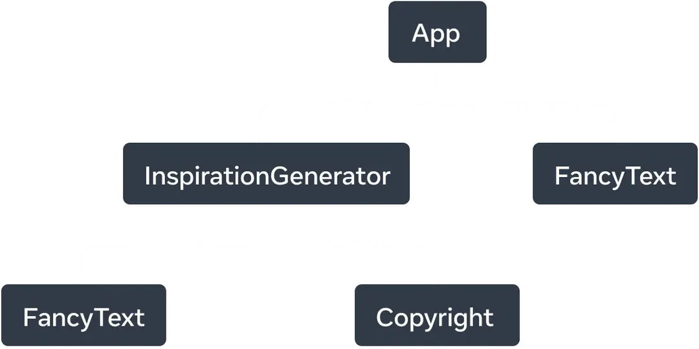
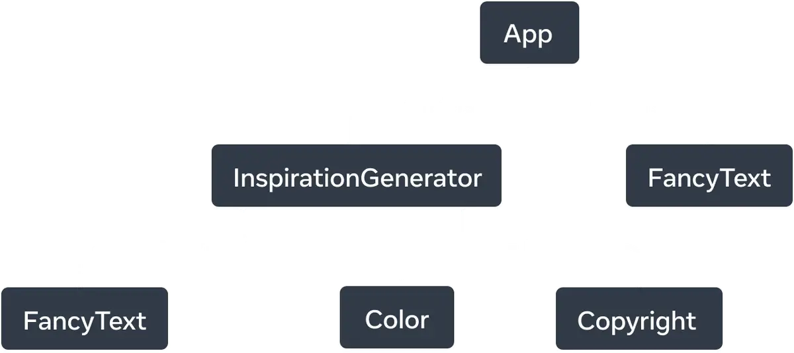
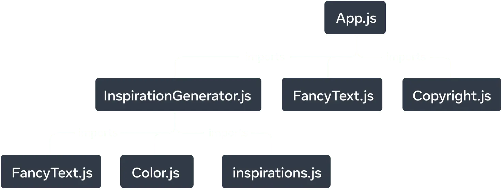

# 개요

React 앱은 서로 중첩된 컴포넌트로 구성되어 있습니다. React는 이 복잡한 구성에서 어떻게 앱의 구조를 추적할 수 있을까요. React를 포함한 많은 UI 라이브러리는 UI를 트리로 모델링합니다. 애플리케이션을 트리로 생각하면 컴포넌트간의 관계를 이해하는 데에 도움이 됩니다.

<aside>
학습 내용

- 컴포넌트 구조를 이해하는 방법
- 렌더 트리가 무엇이고 어떤 용도로 사용되는지
- 모듈 의존성 트리가 무엇이고 어떤 용도로 사용되는지
</aside>

# 트리로서의 UI

트리는 요소와 UI 사이의 관계 모델이며 UI는 종종 트리 구조를 사용하여 표현됩니다. 예를 들어, 브라우저는 HTML (DOM)과 CSS (CSSOM)를 모델링 하기 위해 트리 구조를 사용합니다. 모바일 플랫폼도 뷰 계층 구조를 나타내는 데 트리를 사용합니다.


_React는 컴포넌트로부터 UI트리를 생성합니다._

React도 React 앱의 컴포넌트 간 관계를 모델링하고 관리하기 위해 트리 구조를 사용합니다. 트리는 데이터가 흐르는 방식과 렌더링 및 앱 크기를 최적화 하는 방법을 이해하는 데에 유용한 도구 입니다.

# 렌더 트리

컴포넌트의 주요 특징은 다른 컴포넌트의 컴포넌트를 구성하는 것입니다. 컴포넌트 안에 컴포넌트를 중첩하면 부모 컴포넌트와 자식 컴포넌트의 개념이 생기며, 모든 컴포넌트는 부모가 될 수도 자식이 될 수도 있습니다.

React 앱을 렌더링할 때, 이 관계를 렌더 트리로 모델링 할 수 있습니다. 아래는 명언을 렌더링하는 React 앱입니다.

```jsx
// App.jsx
import FancyText from "./FancyText";
import InspirationGenerator from "./InspirationGenerator";
import Copyright from "./Copyright";

export default function App() {
  return (
    <>
      <FancyText title text="Get Inspired App" />
      <InspirationGenerator>
        <Copyright year={2004} />
      </InspirationGenerator>
    </>
  );
}
```

```jsx
// FancyText.jsx
export default function FancyText({ title, text }) {
  return title ? (
    <h1 className="fancy title">{text}</h1>
  ) : (
    <h3 className="fancy cursive">{text}</h3>
  );
}
```

```jsx
// InsprationGenerator.js
import * as React from "react";
import quotes from "./quotes";
import FancyText from "./FancyText";

export default function InspirationGenerator({ children }) {
  const [index, setIndex] = React.useState(0);
  const quote = quotes[index];
  const next = () => setIndex((index + 1) % quotes.length);

  return (
    <>
      <p>Your inspirational quote is:</p>
      <FancyText text={quote} />
      <button onClick={next}>Inspire me again</button>
      {children}
    </>
  );
}
```

```jsx
// Copyright.jsx
export default function Copyright({ year }) {
  return <p className="small">©️ {year}</p>;
}
```

```js
// quotes.js
export default [
  "Don’t let yesterday take up too much of today.” — Will Rogers",
  "Ambition is putting a ladder against the sky.",
  "A joy that's shared is a joy made double.",
];
```



<div align='center'>

_React는 렌더링된 컴포넌트로 구성된 UI트리인 렌더 트리를 생성합니다._

</div>

트리는 노드로 구성되어 있고, 각 노드는 컴포넌트를 나타냅니다. `App`, `FancyText`, `Copyright` 등은 모두 트리의 노드입니다.

React 렌더 트리에서 루트 노드는 앱의 Root 컴포넌트 (App.jsx) 입니다. React가 처음으로 렌더링하는 컴포넌트 입니다. 트리의 각 화살표는 부모에서 자식을 가리킵니다.

<aside class='info'>
렌더 트리는 React 컴포넌트로만 구성되어 있습니다.

UI 프레임워크로서 React는 플랫폼에 독립적입니다. React 앱은 모바일이나 데스크톱 플랫폼에 렌더링 될 수 있으며 각 플랫폼에 맞는 UI 기본 요소에 사용할 수 있습니다.

</aside>

조건부 렌더링을 사용하면 부모 컴포넌트에 전달된 데이터에 따라 다른 자식을 렌더링할 수 있습니다.

```jsx
// App.jsx
import FancyText from "./FancyText";
import InspirationGenerator from "./InspirationGenerator";
import Copyright from "./Copyright";

export default function App() {
  return (
    <>
      <FancyText title text="Get Inspired App" />
      <InspirationGenerator>
        <Copyright year={2004} />
      </InspirationGenerator>
    </>
  );
}
```

```jsx
// FancyText.jsx
export default function FancyText({ title, text }) {
  return title ? (
    <h1 className="fancy title">{text}</h1>
  ) : (
    <h3 className="fancy cursive">{text}</h3>
  );
}
```

```jsx
// InsprationGenerator.js
import * as React from "react";
import inspirations from "./inspirations";
import FancyText from "./FancyText";
import Color from "./Color";

export default function InspirationGenerator({ children }) {
  const [index, setIndex] = React.useState(0);
  const inspiration = inspirations[index];
  const next = () => setIndex((index + 1) % inspirations.length);

  return (
    <>
      <p>Your inspirational {inspiration.type} is:</p>
      {inspiration.type === "quote" ? (
        <FancyText text={inspiration.value} />
      ) : (
        <Color value={inspiration.value} />
      )}

      <button onClick={next}>Inspire me again</button>
      {children}
    </>
  );
}
```

```jsx
// Copyright.jsx
export default function Copyright({ year }) {
  return <p className="small">©️ {year}</p>;
}
```

```js
// quotes.js
export default [
  {
    type: "quote",
    value: "Don’t let yesterday take up too much of today.” — Will Rogers",
  },
  { type: "color", value: "#B73636" },
  { type: "quote", value: "Ambition is putting a ladder against the sky." },
  { type: "color", value: "#256266" },
  { type: "quote", value: "A joy that's shared is a joy made double." },
  { type: "color", value: "#F9F2B4" },
];
```

```jsx
// Color.jsx

export default function Color({ value }) {
  return <div className="colorbox" style={{ backgroundColor: value }} />;
}
```



<div align='center'>

_조건부 렌더링을 사용하면, 서로 다른 렌더링에서 렌더 트리가 다른 컴포넌트를 렌더링 할 수 있습니다._

</div>

이 예시에서, `inspiration.type`이 무엇이냐에 따라 `<FancyText>` 또는 `<Color>`를 렌더링할 수 있습니다. 렌더 트리 또한 각 렌더링마다 다를 수 있습니다.

렌더 트리는 최상위 컴포넌트와 리프 컴포넌트가 무엇인지를 식별하는데 도움이 됩니다. 최상위 컴포넌트는 루트 컴포넌트에 가장 가까운 컴포넌트이며, 그 아래의 모든 컴포넌트의 렌더링 성능에 영향을 미치며, 가장 복잡합니다. 리프 컴포넌트는 트리의 맨 아래에 있으며 자식 컴포넌트가 없고 자주 리렌더링 됩니다.

이 컴포넌트 카테고리를 식별하는 게 앱의 데이터 흐름과 성능을 이해하는데 중요한 부분입니다.

# 모듈 의존성 트리

앱의 모듈 의존성도 트리로 모델링이 가능합니다. 특정 컴포넌트 로직을 별도의 파일로 분리하면 컴포넌트, 함수, 상수를 내보내는 JS 모듈을 만들 수 있습니다.

모듈 의존성 트리의 각 노드는 모듈이며, 각 가지는 해당 모듈의 import 문을 나타냅니다.

이전의 영감 앱을 사용하면 모듈 의존성 트리를 구축할 수 있습니다.



<div align='center'>

_영감 앱의 모듈 의존성 트리_

</div>

트리의 루트 노트는 루트 모듈이며, _엔트리 포인트 파일_ 이라고도 합니다. 일반적으로 루트 컴포넌트를 포함하는 모듈입니다.

동일한 앱의 렌더 트리와 비교하면 유사한 구조이지만 몇 가지 차이점이 있습니다.

- 트리를 구성하는 노드는 모듈입니다.
- `inspiration.js` 와 같은 컴포넌트가 아닌 모듈도 이 트리에 나타납니다. 렌더 트리는 컴포넌트만 캡슐화 합니다.
- `Copyright.js`가 `App.js` 아래에 나타나지만, 렌더 트리에서 `Copyright` 컴포넌트는 `InspirationGenerator`의 자식으로 나타납니다. 이는 `InspirationGenerator`가 자식 Props로 JSX를 허용하기 때문에, `Copyright`를 자식 컴포넌트로 렌더링하지만 모듈을 가져오지는 않습니다. `InspirationGenerator` 입장에선 어떤 컴포넌트가 자식으로 올지 아무래도 상관 없는 입장입니다.

의존성 트리는 React 앱 실행에 필요한 모듈을 결정할때 유용합니다. React 앱을 프로덕션 용으로 빌드할 때, 일반적으로 클라이언트에 제공할 모든 필요 JavaScript를 번들로 묶는 빌드 단계가 있습니다. 이 작업을 담당하는 도구를 **번들러** 라고 하며 번들러는 의존성 트리를 사용하여 포함해야 할 모듈을 결정합니다.

앱이 커짐에 따라 번들 크기도 커집니다. 번들 크기가 커지면 클라이언트가 다운로드하고 실행하는데 필요한 비용도 커집니다. 이로 인해 UI가 화면에 그려지는 데 시간이 더 걸릴 수도 있습니다. 앱의 의존성 트리를 파악하면 이러한 문제를 디버깅 할때 큰 도움이 될 수 있습니다.

# 요약

- 트리는 요소의 관계를 나타내는 방법.
- 렌더 트리는 단일 렌더링에서 React 컴포넌트 간의 중첩 관계를 나타냄.
- 조건부 렌더링을 사용하면 렌더 트리 또한 다른 렌더링으로 변경되 다른 컴포넌트를 렌더링 할 수 있다.
- 렌더 트리는 컴포넌트의 상하 관계를 파악하는데 도움이 됨. 최상위 컴포넌트는 그 아래의 모든 렌더링 성능에 영향을 미침. 리프 컴포넌트는 자주 리렌더링 됨.
- 의존성 트리는 React 앱의 모듈 의존성을 나타내는 방법.
- 의존성 트리는 배포시 필요한 코드를 번들링할 때 사용된다.
  의존성 트리는 느리게 페인트 되는 큰 번들 크기를 디버깅할 때 유용. 어떤 코드를 번들로 묶을지 최적화할 기회 제공.

## 참조

- React 공식 문서
