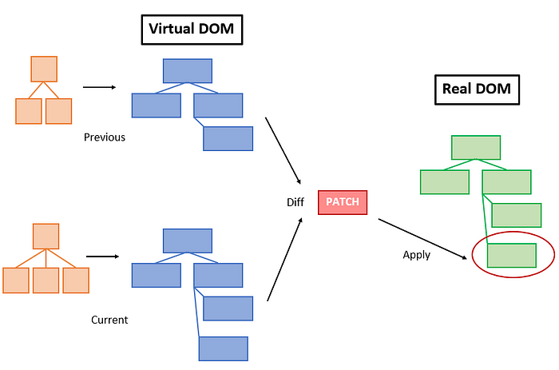

# ✅ Virtual DOM

리액트에서는 state 변경같은 값의 변화가 일어나게 되면 렌더링이 일어나게 됩니다. 이때 virtual DOM 이라는 임시 DOM에 반영된 변경 사항과 변경 되기 전에 실제 DOM을 비교하는 Diffing 알고리즘을 통해 비교에서 변화된 부분을 실제 DOM에 반영합니다. 위와 같은 과정을 Reconciliation (재조정) 이라고 표현합니다.

이는 리액트에서 성능의 이점을 위해 자동적으로 렌더링 이전 거치는 작업입니다.

# ✅ 리액트에서 Virtual DOM을 사용하는 이유

1. **성능 향상**: 실제 DOM 조작은 비용이 많이 드는 작업입니다. Virtual DOM은 실제 DOM 조작이 발생하기 전에 가상의 DOM 트리를 메모리 상에 구성하여, 이를 통해 최소한의 DOM 조작만 수행함으로써 성능을 향상시킵니다. 변화가 있는 부분만을 감지하여 실제 DOM을 업데이트하므로, 전체적인 페이지 리렌더링이 발생하지 않고 부분적인 업데이트만 가능하게 됩니다.
2. **크로스 플랫폼 호환성**: Virtual DOM은 실제 DOM과는 독립적으로 작동하기 때문에, 리액트 애플리케이션은 서버 사이드 렌더링 (SSR) 및 모바일 애플리케이션과 같은 다양한 환경에서 쉽게 사용될 수 있습니다.
3. **편의성과 유지보수성**: 가상 DOM은 개발자가 더 편리하게 UI를 조작하고 유지보수할 수 있도록 합니다. 리액트는 가독성이 뛰어나고 유지보수하기 쉬운 JSX 문법을 사용하여 가상 DOM을 만들기 때문에, 개발자들은 UI 코드를 더 쉽게 이해하고 수정할 수 있습니다.
4. **일관성 유지**: Virtual DOM은 리액트의 단방향 데이터 흐름을 유지하고 UI 상태를 예측 가능하게 만듭니다. 상태 변경에 따라 Virtual DOM이 업데이트되고 렌더링되는 방식은 항상 일관성을 유지하므로, 예상하지 못한 UI 동작이 발생할 가능성을 줄여줍니다.

이러한 이유로, Virtual DOM은 리액트에서 중요한 개념 중 하나로, 성능, 유지보수성, 확장성 등을 향상시키는 데 기여합니다.
