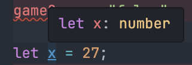

# 타입 애너테이션은 대부분 필요없다.

실제로 변수를 작성할 때는 타입 추론(Inference)을 사용하면 된다. 타입스크립트를 학습하는 초기 과정에서 육안으로 확인하기 위해 사용한걸로 충분하다. 타입스크립트는 생각보다 꽤 똑똑하기 때문에 할당되는 값만 보고 필요한 타입을 유추해낸다. 다음 예제를 보자.

```typescript del={2}
let x = 27;
x = "Twenty-Seven"; // 'string' 형식은 'number' 형식에 할당할 수 없습니다.ts(2322)
```

위와 같이 애너테이션 없이 값만 할당할 경우 타입스크립트는 알아서 타입을 유추한다. 그리고 해당 변수에 다른 타입의 값을 할당하려 하면 타입이 다르다고 오류를 표시한다. 이와 같은 방법으로 불필요한 타입 애너테이션 구문을 삭제해 보다 가시성 좋은 코드를 작성할 수 있다.

추론된 타입을 알고 싶다면 해당 변수위에 마우스를 올리면 툴팁으로 유추되고 있는 타입이 표시된다.

<div align='center'>



</div>
