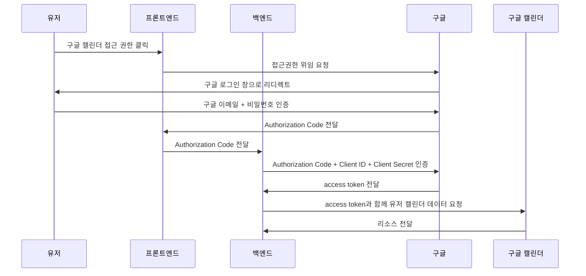
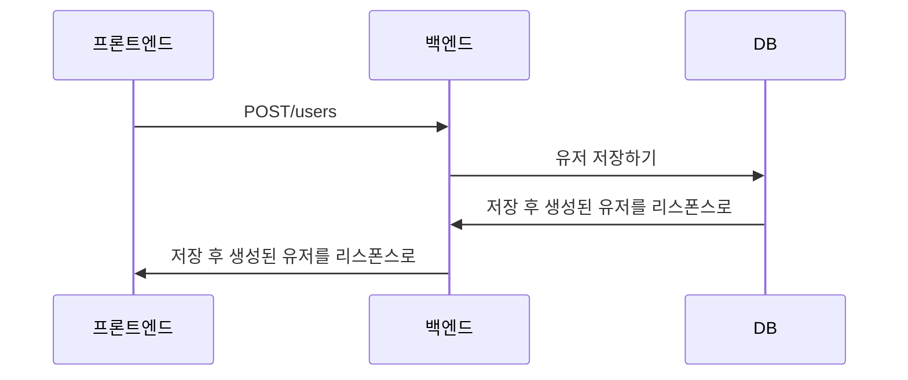
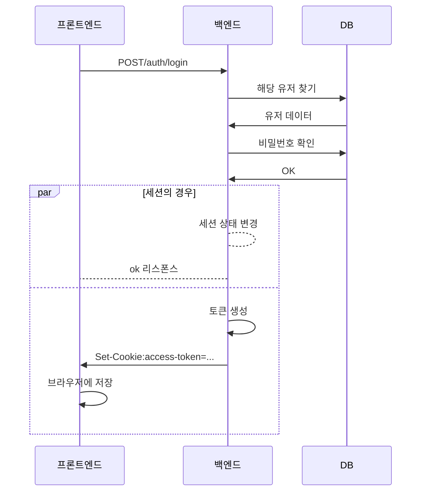
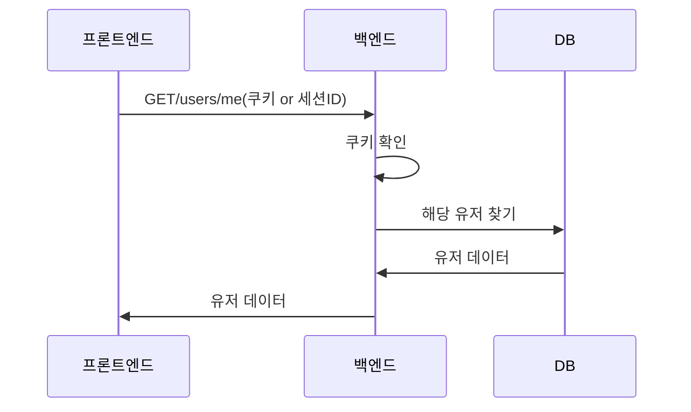
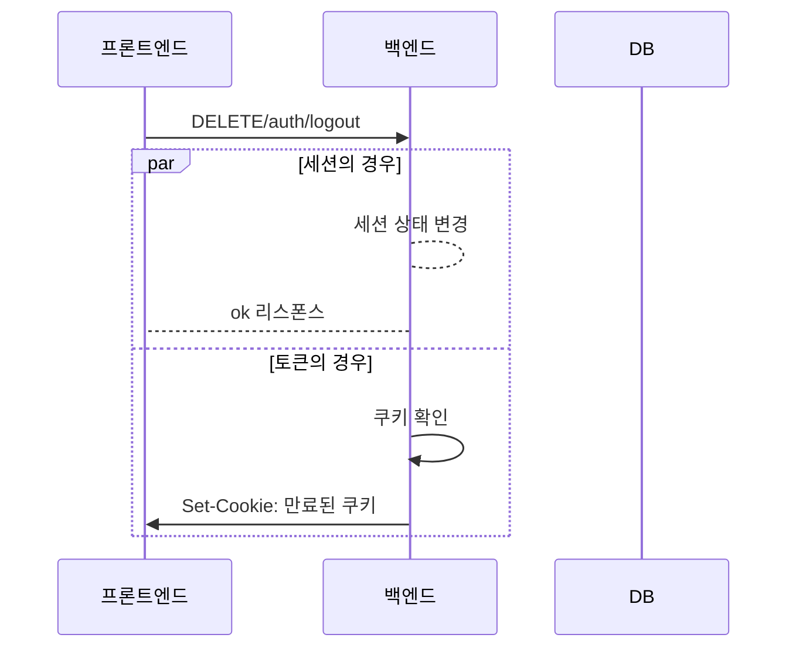
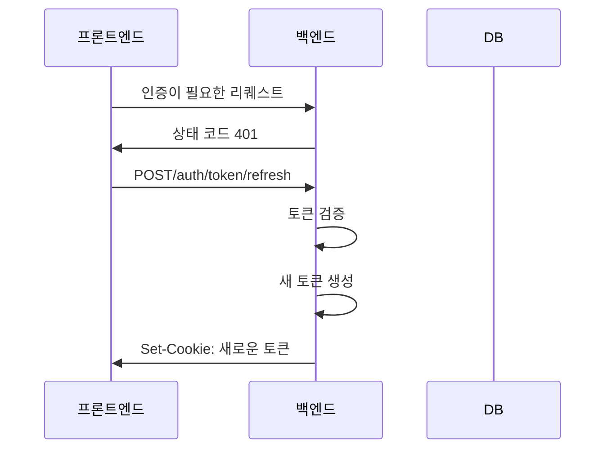
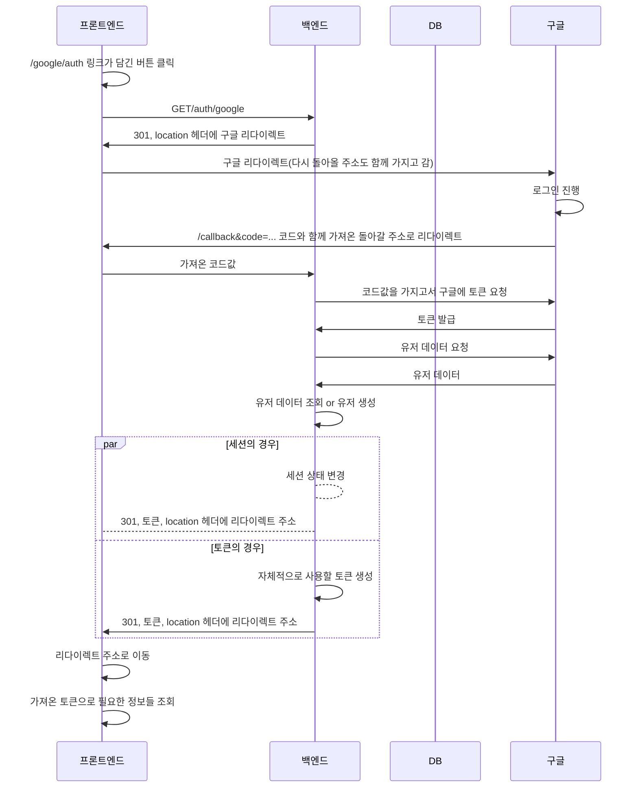

# OAuth (접근 권한 위임 표준)

## OAuth의 워크플로우

순서를 하나씩 들여다보면

1️⃣ 유저가 사이트에서 구글 캘린더 연동을 클릭할 시

2️⃣ 해당 사이트의 프론트는 구글로 접근 권한 위임을 요청하게 되고

3️⃣ 해당 사이트에서 구글 로그인 창으로 리다이렉트 됩니다.

4️⃣ 유저가 자신의 구글 이메일과 비밀번호를 입력하고 성공하면

5️⃣ 구글이 인가 코드를 해당 사이트의 프론트에 전달하게 되고

6️⃣ 프론트에선 인가 처리를 위해 다시 백엔드로 코드를 전달합니다.

7️⃣ 전달받은 코드로 백엔드에서 다시 구글에게 인가 코드와 클라이언트 아이디, 클라이언트 시크릿을 인증 요청을 하고

8️⃣ 요청에 성공했다면 엑세스 토큰을 내려줍니다.

9️⃣ 백엔드는 헤더에 엑세스 토큰을 담아 유저 캘린더 데이터를 구글에 요청합니다.

🔟 해당 요청이 해당 유저의 인가 범위 내에 있다면 이제 구글은 해당하는 리소스를 전달하게 됩니다.

# 유저 기능 워크플로

## 회원가입

## 로그인

세션 기반의 경우, 백엔드에서 토큰을 생성하는 부분이 세션 상태 변경으로 바뀌게 되고 그 뒤 쿠키를 보내주는 부분이 ok의 리스폰스를 돌려주는걸로 바뀌게 됩니다. 클라이언트에선 세션 정보가 이미 있기에 따로 새롭게 저장할 것은 없습니다.

## 유저 데이터 가져오기

## 로그아웃

클라이언트에서 토큰을 조작할 수 있는 경우 클라이언트 단에서 토큰을 삭제하면 되기에 리퀘스트가 필요치 않습니다. 하지만 쿠키의 httpOnly같은 메소드를 사용한 토큰의 경우 토큰 만료화를 위한 리퀘스트가 필요합니다.

세션 기반의 경우 리퀘스트로 넘어온 세션 ID를 이용해 백엔드에서 세션 상태를 변경하고 ok를 리스폰스로 보내줍니다.

## 토큰 갱신하기

## 구글 로그인

