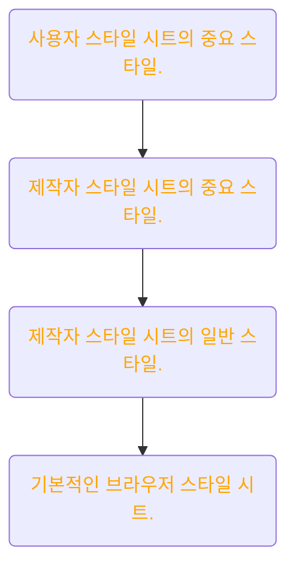
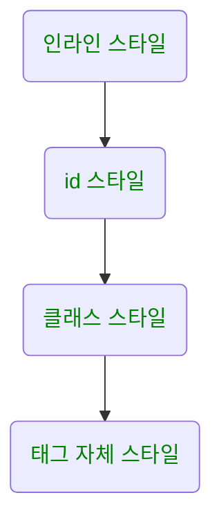

# CSS 란 ?

css는 cascading style sheet의 약자로 ‘위에서 아래로 흐르는 스타일 시트’ 라는 뜻으로 볼 수 있다. 여기서 cascading 이 곧, html 태그 요소들에 최종 적용될 css 의 우선 순위 이자 규칙이다. 예를 들어 텍스트 단락의 글자 색은 문서 전체의 글자 색을 정해 놓은 스타일 규칙을 따를 수도 있고 브라우저에서 기본적으로 정해 놓은 글자 색, 혹은 웹 제작자가 정해 놓은 p 선택자의 글자 색을 따를 수도 있다. 만약 동시에 적용된다면 글자 색은 어느 스타일 규칙을 따라가야 할까?

이 방법엔 두 가지 원칙이 있다.

<aside>
👉 1. 스타일 우선 순위
 - 스타일 규칙의 중요도, 적용 범위에 따라 우선순위가 결정되고 그 우선순위에 따라 위에 서 아래로 스타일이 적용
2. 스타일 상속
 - 태그들의 포함 관계에 따라 부모 요소의 스타일을 자식 요소로, 위에서 아래로 전달합니다.

</aside>

# 1. 스타일 우선 순위

첫 번째 원칙, css 적용에서 가장 중요한 개념이다. 이 우선순위는 다음의 3가지 원칙에 따라 적용된다.

## 중요도 (Importance)



1. **사용자 스타일 시트의 중요 스타일** : 사용자 스타일 시트는 저시력자나 색약자 등과 같은 특별한 조건이 필요한 사용자를 위해 시스템 상에서 구비된 스타일 시트를 말한다.이는 제작자가 제어할 수 없는 영역 이기에 최우선 스타일로 적용된다.
2. **제작자 스타일 시트의 중요 스타일** : 제작자가 만든 스타일 중 !important 가 붙은 스타일은 제작자가 제어한 스타일 중 최우선 적으로 적용되는 스타일이다.
3. **제작자 스타일 시트의 일반 스타일** : 일반적으로 사용자가 작성한 css 코드들이 해당된다. 여기서 적용된 스타일은 적용 범위에 따라 또 달라 진다.
4. **기본적인 브라우저 스타일 시트** : 브라우저 마다 기본적으로 지정된 스타일이다. 기본적으로 태그들이 가지고 있는 스타일들이 해당된다고 볼 수 있다.

## 명시도 (Specificty)

하나의 요소에 여러 스타일이 중복되어 적용된다면 해당 스타일이 적용된 선택자에 따라 우선 순위가 달라진다. 스타일 적용 범위가 좁고 명확할 수록 그 우선 순위가 높아진다.

다음 순서는 가장 중요한 순서부터 차례대로 나열한 것이다.



## 선언 순서 (Source Order)

선언된 순서에 따라 우선 순위를 적용한다. 소스에서 나중에 온 스타일이 먼저 온 스타일을 덮어쓴다.

```html
<style>
  body {
    color: blue; /* 문서 전체의 글자 색 */
  }
  h2 {
    color: brown !important; /* h2의 글자 색, 중요 스타일 */
  }
</style>
<body>
  <div id="container">
    <h2 style="color:green;">I am Green</h2>
    <p style="color:red; font-style:italic;">I am Red</p>
  </div>
</body>
```

# 2. 스타일 상속

두 번째 원칙, 스타일 시트에서 자식 요소에서 별도의 스타일을 지정 하지 않으면 부모 요소에 있는 스타일 속성들이 자식 요소에게 전달되는데 이것을 ‘스타일 상속’ 이라 한다.

예시로 body 태그에 color 태그를 작성하면 color 속성을 지정하지 않은 이하의 자식 요소 모두에게 같은 color가 적용 된다. 주의할 것은 모든 스타일 속성이 자식에게 상속 되지는 않는다.

다음은 주요 상속 가능 여부를 나타낸 표이다.

| width/height          | no  |
| --------------------- | --- |
| margin                | no  |
| padding               | no  |
| border                | no  |
| box-sizing            | no  |
| display               | no  |
| visibility            | yes |
| opacity               | yes |
| background            | no  |
| font                  | yes |
| color                 | yes |
| line-height           | yes |
| text-align            | yes |
| vertical-align        | no  |
| text-decoration       | no  |
| white-space           | yes |
| position              | no  |
| top/right/bottom/left | no  |
| z-index               | no  |
| overflow              | no  |
| float                 | no  |
