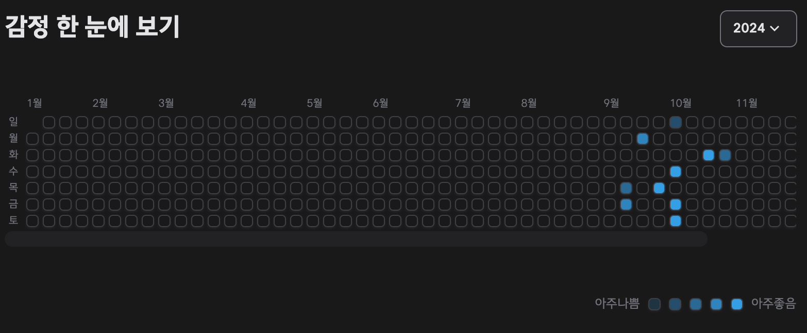
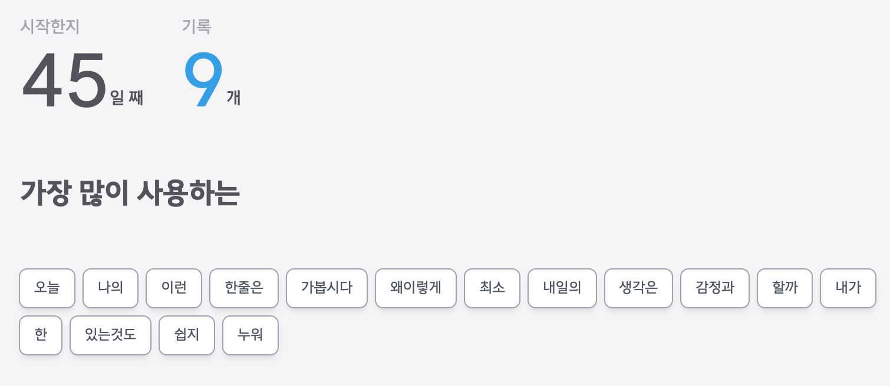
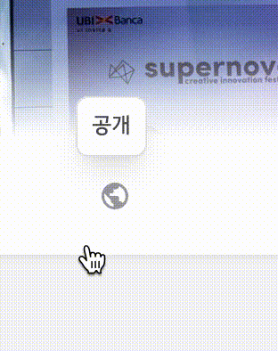
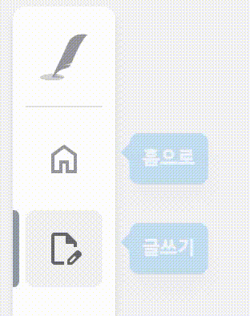

사용자를 고려한 UI 개발에 집중하며, 팀원들과의 협업을 통해 더 나은 결과물을 만들어내는 데 열정을 가지고 있습니다.

## 연락처.

---

<aside>

HP : 010-9383-4485

이메일 : sleepnowinthefire66@gmail.com

깃허브 : https://github.com/kidboi666

블로그 : [https://my-blog-eight-rose.vercel.app](https://my-blog-eight-rose.vercel.app/)

</aside>

## 프로젝트 경험.

---

<aside>

프로젝트명 : **하루 한줄** (2024.09 - 진행중)

인원 : 개인

홈페이지 : [https://one-sentence-gray.vercel.app](https://one-sentence-gray.vercel.app/home)

깃허브 : https://github.com/kidboi666/one_sentence

</aside>

### 개요

매일 자신이 느끼는 감정을 글로 기록하여 감정 변화를 색깔로 볼 수 있게 정리해주는 일기장 플랫폼

### 기술 스택

`TypeScript`, `React`, `tailwindcss`, `Next.js (App Router)`, `ReactQuery`

### 주요 구현 기능

- 글을 쓰면 잔디밭 형태의 기록이 남음

<aside>

→ 1월 1일의 요일 값을 구하고, 일요일에서 떨어진 만큼 빈 블럭을 채워 잔디밭의 정확한 시작 위치 설정

</aside>

- 작성한 게시물에 자주 사용한 단어 구분 로직 구현

<aside>

→ db에 단어 사전과 같은 테이블을 만들고, 해당 db 정보를 통해 사용 횟수 2회를 넘긴 단어들만 순서대로 화면에 출력하는 식으로 구현

</aside>

- 애니메이션 로직 개선
<aside>

→ onTransitionEnd 속성과 data-set을 이용해 부드러운 마운트,언마운트 애니메이션으로 조작감 부여

</aside>

| 툴팁 애니메이션                                                                             | 툴팁 애니메이션2                                                                             |
| ------------------------------------------------------------------------------------------- | -------------------------------------------------------------------------------------------- |
|  |  |

---

<aside>

프로젝트명 : **Mogazoa** (2024.07 - 2024.08 : 1개월)

인원 : 팀 (프론트 5명)

홈페이지 : https://mogazoa-lac.vercel.app/

깃허브 : https://github.com/Codeit-FE-5-part4-5/Mogazoa

</aside>

### 개요

각종 상품에 대한 리뷰를 나누고 기록하는 플랫폼 입니다.

### 기술 스택

`TypeScript`, `React`, `tailwindcss`, `Next.js (Page Router)`, `ReactQuery`, `shadcn/ui`

### 내가 담당한 부분

- 카카오와 구글 소셜 로그인 연동

<aside>

→ 소셜 로그인이 필요한 리디렉션 동작을 Rest Api 를 통해 구현

</aside>

- Button 컴포넌트와 Tag 컴포넌트 구축

<aside>

→ variant, size, disabled 와 같은 props를 정의하고 조건에 따른 loading 컴포넌트도 내부에 표현

</aside>

- 예외 처리, 로딩 처리

<aside>

→ Suspense와 Error Boundary로 각각 예외 처리를 구현하고 Map 생성자를 통해 다양한 스켈레톤 ui를 전달

</aside>

## 기타 활동.

---

<aside>

**코드잇 프론트엔드 부트캠프 수료**

2024.02 - 2024.08 (6개월)

- 매주 정해진 미션을 구현하여 멘토에게 코드 리뷰를 받고 지적 사항을 수정
- 3번의 팀 프로젝트 과정 경험
</aside>

## 기술 역량.

---

**HTML & CSS**

- 시맨틱에 대한 지식을 꾸준히 학습합니다.
- Grid 와 Flex 를 사용하여 반응형 작업을 모든 프로젝트에 적용하였습니다.

**JavaScript**

- 매일 아침 10분씩 기본기에 해당하는 자바스크립트를 꾸준히 학습 합니다.
- Promise를 사용하여 데이터 요청, 코드 실행을 정해진 시간동안 잠시 미루는 등의 간단한 비동기 작업들을 구현 했습니다.

**React**

- Suspense와 Error Boundary를 이용해 예외 처리와 간단한 로딩 처리를 할 수 있습니다.
- Context Api, Redux Toolkit, zustand와 같은 라이브러리를 사용하여 전역 상태 관리가 가능합니다.

**Next.js**

- Middleware를 사용하여 로그인 상태에 따라 접근가능 여부를 판단하여 리디렉션 하는 동작을 구현 했습니다.
- App router와 Page router 각각 특성에 맞게 사용할 수 있습니다.

**Supabase**

- 트리거 함수를 이용해 특정 테이블의 로우가 변하면 특정 함수의 값이 변하도록 db를 구축합니다.
- supabase auth의 회원 정보를 참조하는 테이블을 만들어 추후 서비스의 변화에 대응할 수 있는 테이블을 제작했습니다.

**Web**

- LocalStorage, Cookie의 차이점과 특성을 이해하고 사용합니다.

## 자기 소개.

---

<aside>

### “나도 잘할 수 있겠다”

유튜브에서 코딩 영상을 보고 ‘나도 저거 잘할 수 있겠다' 라는 자신감이 생겼습니다. 그 후 유튜브의 제로초 채널을 구독해 자바스크립트를 배우며, **예시로 나온 웹 게임들을 기초 문법만으로 직접 구현해보았습니다.** 순서도를 작성해가며 논리를 세우는 재미를 느끼고 좀 더 체계를 갖춘 지식을 배우고 싶은 욕심이 생겼습니다. 고민 끝에 6개월의 프론트엔드 부트캠프 과정을 등록했고 혼자하는 코딩에서 함께하는 코딩의 재미를 느낄 수 있었습니다.

</aside>

<aside>

### “항상 학습 진도가 빠르고 학습에 오랜 시간을 투자하는 게 느껴집니다”

이 문장은 실제로 팀원에게 들은 피드백입니다. 저는 흥미를 느끼는 분야에 깊이 파고드는 것을 좋아해 유료 강의까지 수강하며 Next.js 지식을 쌓았습니다. **개념을 익힌 후엔 빠르게 적용해 실무에서의 시행착오를 직접 경험하며 학습을 이어갔습니다.**

결국, 이러한 학습 방식 덕분에 ‘아이디어를 웹 화면으로 구현’하는 프로그래밍의 원초적 재미를 느낄 수 있었고 **프로젝트를 진행할 때마다 완성도를 높이는 데 적극적이었다는 팀원들의 일관된 피드백도 받을 수 있었습니다.**

</aside>

<aside>

### “배려심으로 문제를 해결하는 사람”

저는 개인과 그룹 프로젝트를 통해 문제 해결의 중요한 열쇠가 ‘배려심’ 이라는 것을 깨달았습니다.

1. **팀원의 문제를 해결**

팀원들이 API 호출을 통해 데이터를 처리하는 데 어려움을 겪고 있었을 때, 저 역시 처음에는 막막했지만, 끊임없는 검색과 수정 끝에 API 호출 시 전달받는 데이터를 한눈에 볼 수 있는 **어드민 페이지를 만들어 팀원들과 공유했습니다.** 이를 통해 프로젝트 진행 속도를 높이고, 적절한 컴포넌트를 쉽게 구성할 수 있었습니다.

2. **사용자를 떠올리며 테스트를 반복**

또한, UI/UX 개발에서도 배려심은 중요한 요소입니다. 유저의 동선을 예측하고 그에 맞춘 상호작용을 설계하는 것이 핵심이기 때문입니다. 저는 UI/UX 디자인에서 발생할 수 있는 작은 불편함도 놓치지 않으려고 노력합니다. “하루 한줄” 이라는 개인 프로젝트를 할 때도 **사용자의 디바이스에 따라 메뉴 위치가 달라질 수 있도록 코드 수정을 수십 번 반복하여 위치를 조정하였고**, 끈질기게 테스트한 덕분에 만족스러운 반응형 레이아웃을 완성할 수 있었습니다.

</aside>

<aside>

### “포기하지 않는 문제 해결력”

프론트엔드 개발에서 새로운 문제는 항상 예상치 못하게 나타납니다. 이러한 과정은 때로는 어려움을, 때로는 성취감을 줍니다. 어려움이 클수록 성취감도 커지기 때문에, 저는 **문제 해결 과정에서 포기하지 않고 끝까지 도전합니다.** 하지만 팀 프로젝트에서는 이러한 과정이 효율적이어야 하므로, 저는 항상 **일정을 고려하여 문제를 해결하려고 노력합니다.** 수백 번의 수동 테스트를 통해 자연스럽고 안정적인 UX를 구현하는 것처럼, 문제를 신속하게 해결하는 것은 저의 **중요한 목표 중 하나입니다.**

</aside>

<aside>

**HP :** 010-9383-4485

**이메일 :** sleepnowinthefire66@gmail.com

**깃허브** : https://github.com/kidboi666

**블로그 :** [https://my-blog-eight-rose.vercel.app](https://my-blog-eight-rose.vercel.app/)

</aside>
